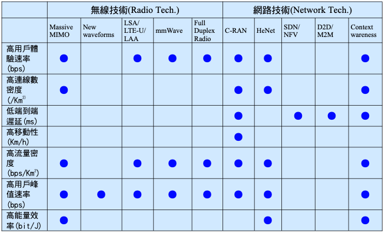
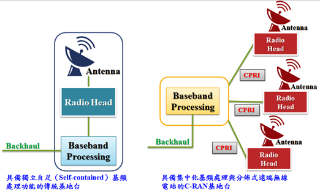
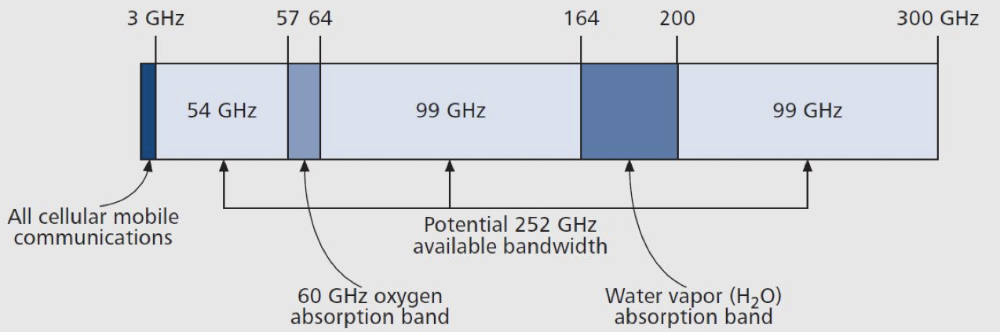
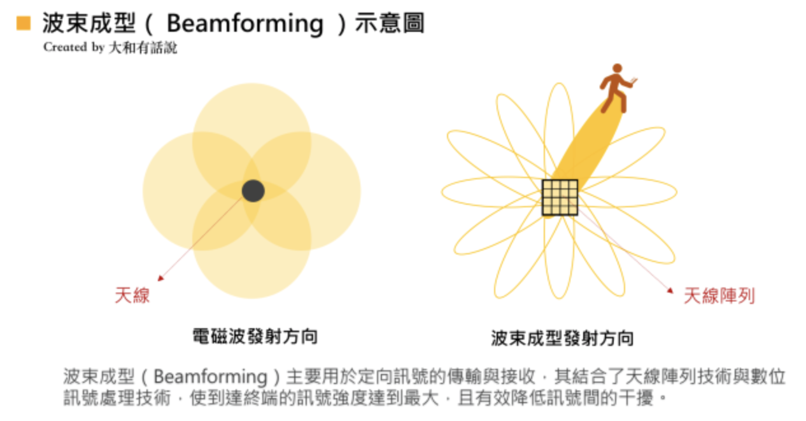
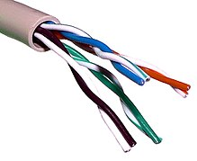
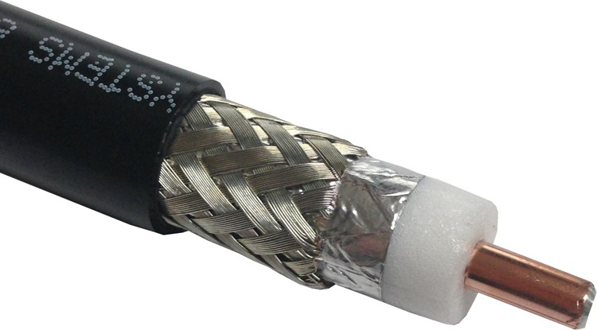
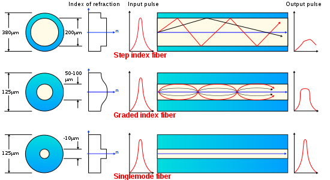

學號：B06901061 ｜系級：電機三 ｜姓名：王廷峻 ｜ Youtube 連結：https://youtu.be/aKauc8Dgin0

## Access Network – wide-area wireless access 

### 無線通訊技術的演進簡介

| 技術 | 服務內容                                | 主要差異                       |
| ---- | --------------------------------------- | ------------------------------ |
| 1G   | 類比語音電話                            | 可進行行動式通訊               |
| 2G   | 數位語音電話與簡訊                      | 安全、大規模商用               |
| 3G   | 數位語音電話、簡訊與數據服務            | 較好的網際網路體驗             |
| 4G   | 全 IP 化網路服務(含語 音與寬頻數據服務) | 較快的寬頻網際網路與較低的遲延 |

- 第一代行動通訊

主要是**類比通訊的技術**，包括: 先進式行動電話服務 (Advanced Mobile Phone Service, AMPS)、北歐行動電話(Nordic Mobile Telephone, NMT)、 完全存取通訊系統(Total Access Communication System, TACS)等，並以傳送類比語音為主要 的應用。

- 第二代行動通訊

有鑒於第一代行動通訊系統的缺失，第二代行動通訊系統採取**數位式的技術**，通話品質不僅較第一代行動電話系統為佳，並具較高的頻譜利用率，具保密性佳，系統容量高的優點，可 提供語音、數據、傳真傳輸以及電信加值服務。

- 第三代行動通訊

為了解決第二代行動通訊系統傳輸速率不敷使用的問題，以及滿足行動通訊產業對**更高傳輸速度及更好的頻譜使用效率的技術需求**，ITU-R(ITU-Radio)於 1997 年開始進行全球第三代行 動通訊技術的標準制定工作，並提出 IMT-2000 計畫。希望用戶在任何時間、任何地點都能接取寬頻無線多媒體服務，以數位語音電話、簡訊與數據服務為主。

- 第四代行動通訊

2008 年 3 月，ITU-R 提 4G 標準的要求，命名為 IMT-Advanced 規範，設定 4G 服務的峰值速度要求在高速移動的通訊(如在火車和汽車上使用)達到 100 Mbps，固定或低速移動的通訊 (如行人和定點上網的用戶)達到 1 Gbps，主要是**提供全 IP 化網路服務**(含語音與寬頻數據服務)。

###第五代行動通訊

 建構第五代通訊的主要挑戰有：**超高速通訊速率、高佈建密度、高行動速率、低遲延時間、大量裝置的連結、一致的用戶體驗及綠能**

​																				source: IMT-2020

#### C-RAN (Cloud Radio Access Network)

在傳統的蜂巢網路架構中，天線（Antenna）、射頻設備（RF equipment）、數位處理器（Digital Processor）、基頻單元裝置（Base Band Unit）全都集中安置在同一個站點的基地台（Base Transceiver Station，BTS） 之中。 相較於傳統基地台，C-RAN主要是由主動式天線陣列（Active Antenna Arrays）、多頻段遠端無線電站（Remote Radio Head，RRH）、集中化基頻單元裝置（Base Band Unit，BBU）、公共管理伺服器（Common Management Server）、雲端無線網路控制器（Radio Network Controllers on Cloud）、大型蜂巢式（Metro Cells）與可實現無縫管理與優化之自我組織網路（Self-Organizing Network，SON）伺服器等元件所組成的**分佈式無線存取網路**。

C-RAN的概念是**打破過去傳統基地台的BBU與RRH之間的固定連結，將繁重的基頻處理功能虛擬化，僅留下簡化的RRH及天線**，且並非如以往與BBU為一對一關係；多個簡化的RRH與天線利用通用公共射頻介面（Common Public Radio Interface，CPRI）與BBU相連後，由BBU進行集中化且具效率的基頻處理作業。

整體而言，C-RAN的本質便是**透過減少基地台機房數量以降低整體能耗，並採取合作式虛擬化技術，實現資源分配與動態的調度，促使頻譜使用效率提高**，進而幫助營運商達到低成本、高頻寬與靈活性的運營。

#### mmWave (Millimeter Wave)

目前因為大部分的通訊頻段已經被使用，再加上 5G 其中的挑戰在於高用戶體驗率、高用戶峰值速率、高流量密度，因此需要朝向使用高頻區段的訊號，也就是毫米波的頻寬範圍。下圖為毫米波的頻率範圍。

- 毫米波使用頻段

  毫米波是指**波長為 1〜10 毫米範圍的電波**，約在 **30G〜300GHz 頻率範圍**，但須排除其中 57G〜 64GHz 和 164G~200GHz （為氧氣及水蒸氣吸收電子能量的範圍）

- 毫米波傳播特性
   (1) **自由空間傳播** (Free space propagation):

  毫米波的衰減主要為自由空間損耗。由於高頻電波的波長較短，導致單一天線的孔徑小於低頻電波的天線孔徑，因此普遍認為天線增益較小，然而在系統設計上，由於高頻電波波長較短，天線的體積相對縮小，同樣的面積內允許配置更多天線，因此單位面積內等效的孔徑(天線增益)應與低頻電波相去不遠。

  (2) **大氣吸收損耗** 

  當毫米波穿越大氣時，氧氣分子，水蒸氣和其它組成大氣的氣態成分的吸收而產生傳輸損耗。在某些頻率下，恰好與氣體分子的共振頻率吻合，部份能量就被氣體分子吸收轉為其共振能量，造成傳輸損耗。

  (3) **降雨衰減**

  毫米波的傳播也受到雨的影響。雨滴的尺寸與毫米波波長的尺寸基本相同，電波的繞射能力差，造成電磁波能量的衰減。

- 毫米波的優勢 

  1. 毫米波快速衰減的特性，剛好符合密集都會地區頻率複用的需求，以免造成其他鏈路信號在天線背後灌入過高輻射能量，而影響該天線前向鏈路信號傳輸品質。
  2. 由於毫米波的短波長特性，使得傳接收端允許配置大型的天線陣列，藉此得到更高的波束增益(Beamforming gain)，不僅能有效對抗因大氣吸收和降雨所帶來的損耗，更能降 鄰近基地台彼此間的干擾，而毫米波基地台也因此得以佈建得更加密集，以解決傳統基地台在細胞邊緣信號品質不佳的問題

  

  | 傳統                               | 毫米波                                                       |
  | ---------------------------------- | ------------------------------------------------------------ |
  | 電磁波向四周發射的方式來傳遞訊號。 | 波束成型（Beamforming），是一種透過「天線陣列」定向發送和接收訊號的技術，其透過在特定方向上發射或接收訊號的疊加，將既有的全向覆蓋，轉換為精準的指向性傳輸，不僅延長了傳送距離，也大幅減少訊號的干擾。 |

# Physical Media

### Guided Media

1. Twisted pair
   最便宜且廣泛使用的媒介。將兩根絕緣的銅導線按一定規格互相絞在一起，可降低訊號干擾的程度。每一根導線在傳輸中輻射的電波會被另一根線上發出的電波抵消。

   使用場景：電話線、網路線（RJ-45）

   使用限制：Low bit rate
   

2. Coaxial cable

   指有兩個同心導體，而導體和屏蔽層又共用同一軸心的電纜。最常見的同軸電纜由絕緣材料隔離的銅線導體組成，在裡層絕緣材料的外部是另一層環形導體及其絕緣體。因為與外界絕緣，同軸電纜能有 high data transmission rate。

   使用場景：電視影像訊號

   資料傳輸形式：share medium 不同 end system 可以連接相同的電線並佔用各自的頻段範圍

   

3. Fiber optics
   光纖是一種由玻璃或塑料製成的纖維，利用光在這些纖維中以全內反射原理傳輸的光傳導工具。

   使用場景：跨洋電纜（長距離資料傳遞）

   特色：high bit rates、不受電磁訊號干擾、low singal attenuation 

   使用限制：高額成本使得短距離鋪設（LAN, Residential access network）不可行
    

### Unguided Media

**Terrestrial Radio Channels**
利用電磁波傳遞訊號，不需要任何介質傳播、可以長距離傳遞且不受纜線的物理限制。然而傳訊品質會受到以下幾點影響：

- environmental consideration: 環境中的物質—氧氣、氮氣、水蒸氣影響電磁波傳遞
- shadow fading: 基地台天線與手機電波之間傳遞受障礙物阻隔，造成損耗增大的現象
- mutipath fading: 為大部分的無線通訊系統其發射端與接收端之間的傳播路徑經常是沒有直視路徑，所以電磁波會碰撞傳送路徑上之障礙物而造成許多反射、繞射，及散射，其中以金屬障礙物及湖泊所造成訊號反射最為嚴重，**使得接收端接收到由多個不同傳送路徑所傳送而來的訊號**，也就是一個信號會抵達接收端許多次，每次的信號強度、相位，及抵達時間都不盡相同。
- interference: 與其他電磁訊號的相互干擾

