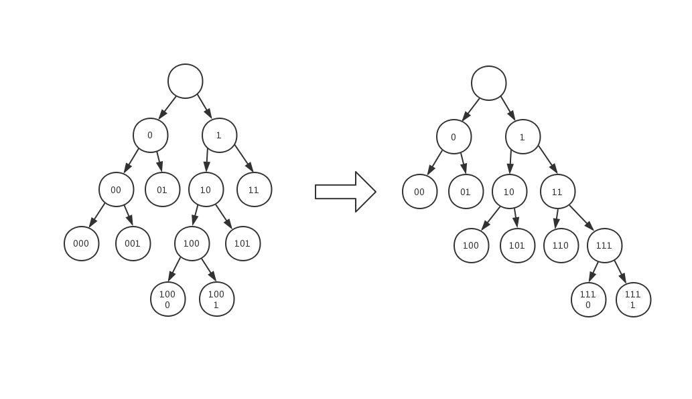

學號：B06901061 ｜系級：電機三 ｜姓名：王廷峻 ｜ Youtube 連結：https://youtu.be/3cWz7-Lfw_U

# The Web

## Workflow of web service


### Server

服務器根據客戶端的請求提供文檔。server 看似只是一台機器：這是因為實際上可能是 server 的集合，共享負載（負載平衡）或詢問其他計算機（例如緩存，數據庫 server 或電子商務）的複雜軟體 server），按需全部或部分生成文檔。 server 不一定是一台電腦，但是可以在同一台電腦上託管多個服務器軟件實例。使用HTTP / 1.1和Host標頭，甚至可以共享相同的IP地址。

### Proxy server

介於 Client 和 server 之間的中介機器

為什麼需要 Proxy server：

1. caching：暫存 server 資料。當有外界的資訊通過時，同時也將其儲存到緩衝區中，當其他用戶再存取相同的資訊時， 則直接由緩衝區中取出資訊，傳給用戶，以提高存取速度
2. filtering：執行防毒掃描與網頁內容監管和監控
3. load balancing：允許分散式的 server 同時 serve 不同 requests
4. authentication ：控制對內部資源的存取。大學FTP，使用教育網內位址段免費代理伺服器，就可以用於對教育網開放的各類FTP下載上傳，以及各類資料查詢共享等服務。

### Client – user agent

Cient 也就是 user agent 代表用戶運行的任何工具。該角色主要由**Web瀏覽器**執行。

Web brower 功能：

1. Initiate request：像 server 發出 request 要求所需資訊
2. Parse response into html：收到來自於 web server 的 html 檔
3. Send additional request corresponding to layout information(i.e., CSS) , execution script, image
4. Demonstrate html and its corresponding sub-resources to users

| Multiple connection                                          | Persistent connection                                        |
| ------------------------------------------------------------ | :----------------------------------------------------------- |
|  |  |
| Client 和 Server 間只會存在一次的 connection<br />當 client request 被 server response 後<br />則 connection 斷開 | Client 和 Server 間保持 connection 連結<br />                |
| Connection: close                                            | Connection: Keep-Alive                                       |

使用 Persistent connection 對比 multiple connection 的好處

1. **節省 CPU time, memory**： connection 數量減少，在 Routers, host 的 CPU time, memory 更節省
2. 在一個 connection 中可將多個 requests 做 pipeline，不需等待 response，增進效率降低等待的重疊時間
3. **降低網路阻塞**：TCP connection 建立需要 handshake，降低 connection 數量進而降低 packet 數量與網路阻塞

# Http


### HTTP is stateless, but not sessionless

HTTP is stateless: 在同個 connection 中，每次 requests 間並不存在關聯性

HTTP isn't sessionless: HTTP cookies 允許記憶 server 回傳給 browser 的內容（stateful）。瀏覽器可能儲存並於下一次請求回傳 cookie 至相同的伺服器。Cookie 通常被用來保持使用者的登入狀態。

**為什麼需要 cookie？**

- Session 管理：帳號登入、購物車、遊戲分數，或任何其他伺服器應該記住的資訊

- 個人化：使用者設定、佈景主題，以及其他設定

- 追蹤：記錄並分析使用者行為

## Decomposition of http request


### Method

| Method    | Description                                                  |
| --------- | ------------------------------------------------------------ |
| `GET`     | 使用 `GET` 的請求只應用於取得資料。                          |
| `POST`    | 傳送資料到伺服器，通常會改變伺服器的狀態或副作用，更改後端內容（可能多次傳輸） |
| `PUT`     | 和 `POST ` 的不同點在於：使用一次和連續使用的效果相同，不會多次傳輸相同的檔案 |
| `DELETE`  | 刪除 server 特定資料                                         |
| `HEAD`    | 和 `GET` 功能完全相同，不過沒有 response body                |
| `CONNECT` | 請求資源啟動一個雙向通訊                                     |
| `TRACE`   | debug 機制：提供 loop-back test                              |
| `OPTION`  | 向 server 請求 connection 支援的 method 種類                 |
| `PATCH`   | 相較於 `PUT` 只能對 server 資料全部更新，`PATCH` 能夠部分更新 |

#### Example

```http
GET /hello.html HTTP/1.1
User-Agent: Mozilla/4.0 (compatible; MSIE5.01; Windows NT)
Host: www.tutorialspoint.com
Accept-Language: en-us
Accept-Encoding: gzip, deflate
Connection: Keep-Alive
```

內容：以通訊協定 HTTP/1.1 對 server (www.tutorialspoint.com) 發送 `GET` method 要求存取 `/hello.html` 的檔案

Client (user-agent)：Browser 為Mozilla/4.0 

Accept-Encoding：傳送資料的 compression algorithm

Connection：Keep-alive 維持 connection 連接不中斷

```http
POST /cgi-bin/process.cgi HTTP/1.1
User-Agent: Mozilla/4.0 (compatible; MSIE5.01; Windows NT)
Host: www.tutorialspoint.com
Content-Type: text/xml; charset=utf-8
Content-Length: length
Accept-Language: en-us
Accept-Encoding: gzip, deflate
Connection: Keep-Alive

<?xml version="1.0" encoding="utf-8"?>
<string xmlns="http://clearforest.com/">string</string>
```

內容：以通訊協定 HTTP/1.1 對 server (www.tutorialspoint.com) 發送 `POST` method 要求傳送資料（request body） 並且以`/cig-bin/process.cgi` 做資料處理。

content-type：告訴 server 傳入的資料型態為 `xml`

content-length：傳入資料的長度（在 connection 為 keep-alive 下可作為 disconnection 的信號）

## Decomposition of http response


### Status code

| Status code    | Description                                                |
| -------------- | ---------------------------------------------------------- |
| 1 information  | request was received and the process is continuing         |
| 2 success      | action was successfully received, understood, and accepted |
| 3 redirection  | action must be taken in order to complete the request      |
| 4 client error | request contains incorrect syntax or cannot be fulfilled   |
| 5 server error | server failed to fulfill an apparently valid request       |

## Evolution of HTTP

### HTTP/2

---

#### Request Multiplexing 多路複用

HTTP/1.x 存在 Head-of-Line blocking 的問題 — request 下載的內容過大時，會阻塞其他 request。雖然 HTTP/1.1 出現了 pipelining 試圖解決這個問題，但因實作細節上的難度，沒有被大多數 browser 支援，且因為要求 request 的 response 要有序，所以若任何一個 request 太大或太慢時，依然會有 blocking 的問題。而 HTTP/2允許 **client 透過同一個 TCP connection 同步發送多個 requests 給 server，而 server 也能用同一個 TCP connection 同步回傳，進而減少額外的 RTT (round trip time)**。

#### 伺服器推送

HTTP/2 的一項新特色是加上了伺服器推送功能，**伺服器可以主動推送內容到瀏覽器上**。這增加了許多特別的新應用，例如可以在瀏覽器尚未發出請求前，預先推送 CSS 或頁面 Layout 到瀏覽器上，增加之後的頁面載入速度。 

####  標頭壓縮與編碼

HEADER 在傳輸的時候，有蠻多重複或冗餘的資訊，這些資訊可藉由 [HPACK 壓縮技術](https://http2.github.io/http2-spec/compression.html) 1. 靜態字典 2. 動態字典 3. 霍夫曼編碼 壓縮 HEADER 來增加傳輸速度。 

- 靜態字典：是先定義好的 Header name 的 indexing 關係，
  

- 動態字典：以 FIFO 的方式 index 重複存在於 header list 中的 header fields

- Huffman encoding：字元出現的頻率來自於從大量的 http header 取樣後的統計量

  傳統的 Huffman encoding：降低儲存資訊的記憶體

  
  HPACK compression 的 Huffman encoding（canonical Huffman code）
  傳統演算法的問題來自於：其中一方必須儲存或整顆傳輸霍夫曼樹以便解碼

  - 每一個樹的節點都要儲存有關它的父節點與子節點等等相關資訊（frequency, probability, pointers）
  - 霍夫曼樹的追蹤需要耗費極大的運算量：
    1. 走過每個節點需要記憶編碼數量：以上圖為例頻率 53 node 為(0)；頻率 24 node 為(01)
    2. 需要尋訪每個節點：$\Omicron(2n-1)=\Omicron(n), \text{n is the number of symbols}$

  **canonical Huffman code**
  左側為傳統的 Huffman tree，右側為經過規範後的 Huffman tree，因為整齊排列的性質可以透過單純記憶**「在高度 h 時，有幾個葉子節點」**加上 $\Omicron(1)$ 的轉換運算直接求得 Code-Symbol 的 mapping 關係

  | 傳統 Huffman tree 轉換 Canonical Huffman tree | $\Omicron(1)$ 的轉換運算                                     |
  | --------------------------------------------- | ------------------------------------------------------------ |
  |   |  |

  ```
  記憶內容										葉子高度和 code 的轉換關係
  －－－－－－－－－－－－－－－－－－－－－－－－－－－－－－－－－－－－－－－－－－－－
  +------+--------------+	  若高度相等：leaf[n] = leaf[n — 1] + 1
  | 高度 | 葉子節點個數 |	  	 若高度差 1 ：leaf[n] = (leaf[n — 1] + 1) * 2
  +------+--------------+ 	若高度差 k ：leaf[n] = (leaf[n — 1] + 1) * 2^k
  | 0    | 0            |
  +------+--------------+   
  | 1    | 0            |
  +------+--------------+
  | 2    | 2            |
  +------+--------------+
  | 3    | 3            |
  +------+--------------+
  | 4    | 2            |
  +------+--------------+
  ```

  在給定「在高度 h 時，有幾個葉子節點」後可以知道每個葉子對應到的 code 是什麼，接著透過其他資訊可以將 code 對應到 symbol

  **Example**

  ```
   1	 2	 3	 4	 5	 6	 7	 8	 9	10	11	12	13	14	15	16   (高度＝code長度)
   -------------------------------------------------------------------------------
   0   2   2   2   1   3   2   5   2   4   5   5   0   3   0   0   (個數 Number)
   
   1   2   0   3   4  11  21   5  12  														 (對應的 symbols)
  31  13  41   6  22  32  51  61  14  71  
  23  81  91  a1  15  42  b1  c1  d1   7  
  33  52  e1  f0  24  62  f1
   -------------------------------------------------------------------------------
  Code length  | Number | Symbol
  -------------+--------+----------
   1 bit       | 0      |
   2 bits      | 2      | 0x01 0x02
   3 bits      | 2      | 0x00 0x03 
   4 bits      | 2      | 0x04 0x11
   5 bits      | 1      | 0x21
   6 bits      | 3      | 0x05 0x12 0x31
   7 bits      | 2      | 0x13 0x41
   8 bits      | 5      | 0x06 0x22 0x32 0x51 0x61
   9 bits      | 2      | 0x14 0x71
  10 bits      | 4      | 0x23 0x81 0x91 0xa1
  11 bits      | 5      | 0x15 0x42 0xb1 0xc1 0xd1
  12 bits      | 5      | 0x07 0x33 0x52 0xe1 0xf0
  13 bits      | 0      | 
  14 bits      | 3      | 0x24 0x62 0xf1
  15 bits      | 0      | 
  16 bits      | 0      | 
  ```

  目前已知每個長度的 code 的數量，再來就可以通過  $\Omicron(1)$ 的轉換運算 求得這些 code 的二進位表示式

  > 1. 若高度相等：leaf[n] = leaf[n — 1] + 1
  > 2. 若高度差 1 ：leaf[n] = (leaf[n — 1] + 1) * 
  > 3. 若高度差 k ：leaf[n] = (leaf[n — 1] + 1) * 2^k

  ```
  Symbol           | Code 
  -----------------+----------------
  0x01             | 00										# initial: 00
  0x02             | 01										# Apply 1.
  0x00             | 100									# Apply 2.
  0x03             | 101									# Apply 1.
  0x04             | 1100									# Apply 2.
  0x11             | 1101									# Apply 1.
  0x21             | 11100								# Apply 2.
  0x05             | 111010								# Apply 2.
  ...              | ...
  0xf0             | 111111111110
  0x24             | 11111111111100
  0x62             | 11111111111101
  0xf1             | 11111111111110
  ```

####  流程下載控制與優先級

藉由控制下載流程的優先級，可以讓 HTTP/2 的傳輸過程中，將最重要的內容優先下載，避免大量資訊堵在一起。 

#### Binary Protocol 二進位協定

HTTP/2 在傳輸時是以 Binary 為主，減輕了實作上的負擔，而且 Binary 的 Parsing 遠遠比 Text 還要來得有效率。在 HTTP/1.1，為了正確處理純文字的 parsing（換行、空行、空白需要特別處理），定義了四種方法，而在 HTTP/2 中只需要一種處理方式。

