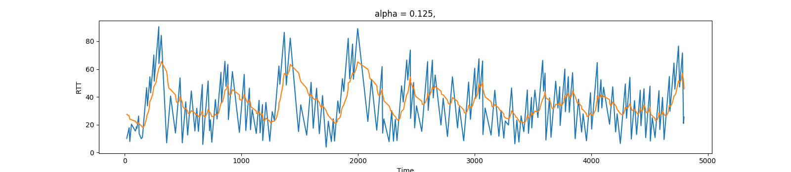
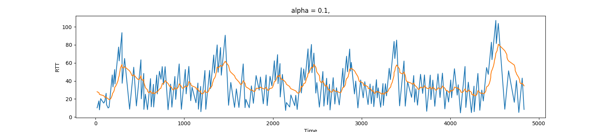
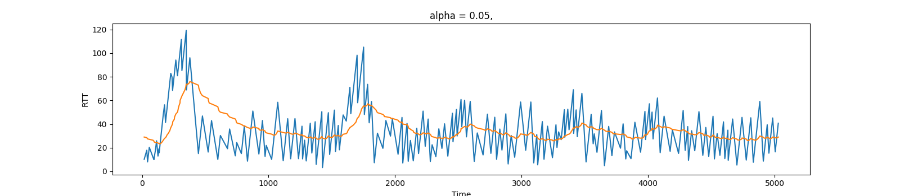
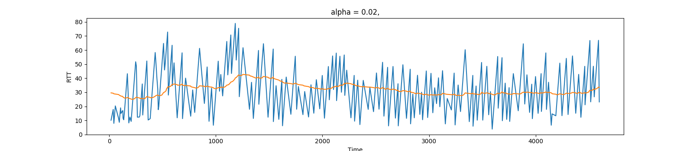
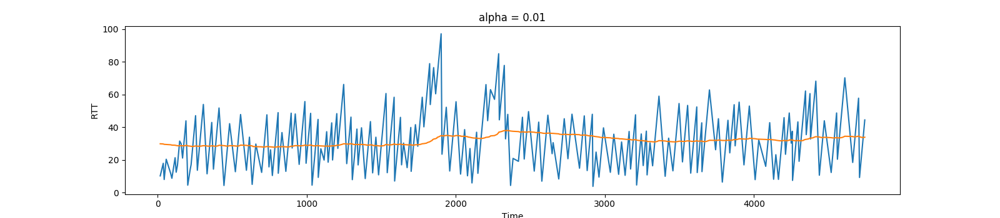
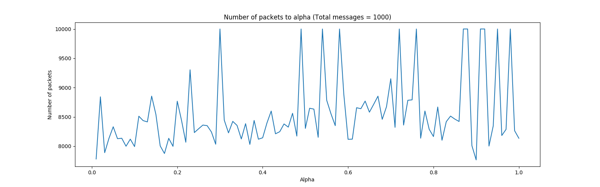

## HW2 GBN protocol

 B06901061 電機三 王廷峻

### GBN Programming

(a) 20 0.1 0.1 10 2（輸出所有 output log）

**Log 輸出文字解釋**

```
## A (sender)
# output
A | send packet: [num]							# A sends a packet with seqnum = num
A | Current Base: [num]							# Current base is indexed as seqnum = num
A | Empty buffer, restart timer			# base == nextSeqNum
A | Window is full. Buffered [num]	# Buffered packet with seqnum = num
# input
A | received corrupt ACK: [num]			# A received corrupt packet with seqnum = num
A | received ACK: [num]							# A received valid packet with seqnum = num
A | ACK is out of date: [num]				# A received a packet with seqnum = num < base
A | New base: [num]									# Update base
A | Empty buffer										# Termination

## B (receiver)
# input
B | received corrupt packet: [num]	# B received corrupt packet with seqnum = num
B | received out of order packet: [num]	# num != Expected seqnum
B | received in order packet: [num]	# num == Expected seqnum
B | send ACK: [num]									# B sends packet with acknum = num
```

```
-----  Stop and Wait Network Simulator Version 1.1 -------- 

the number of messages to simulate: 20
packet loss probability: 0.100000
packet corruption probability: 0.100000
average time between messages from sender's layer5: 10.000000
TRACE: 2

EVENT time: 6.965711,  type: 1, fromlayer5  entity: 0
A | send packet: [1]
A | Current Base: [1]
A | Empty buffer, restart timer

EVENT time: 12.374607,  type: 2, fromlayer3  entity: 1
B | received in order packet: [1]
B | send ACK: [1]

EVENT time: 17.132755,  type: 2, fromlayer3  entity: 0
A | received ACK: [1]
A | New base: [2]
A | Empty buffer

EVENT time: 19.661861,  type: 1, fromlayer5  entity: 0
A | send packet: [2]
A | Current Base: [2]
A | Empty buffer, restart timer

EVENT time: 28.642408,  type: 1, fromlayer5  entity: 0
A | send packet: [3]
A | Current Base: [2]

EVENT time: 29.189991,  type: 2, fromlayer3  entity: 1
B | received in order packet: [2]
B | send ACK: [2]

EVENT time: 31.887445,  type: 1, fromlayer5  entity: 0
A | send packet: [4]
A | Current Base: [2]

EVENT time: 32.231213,  type: 1, fromlayer5  entity: 0
A | send packet: [5]
A | Current Base: [2]
          TOLAYER3: packet being lost

EVENT time: 37.491920,  type: 2, fromlayer3  entity: 1
B | received in order packet: [3]
B | send ACK: [3]

EVENT time: 38.978420,  type: 2, fromlayer3  entity: 0
A | received ACK: [2]
A | New base: [3]

EVENT time: 44.445282,  type: 2, fromlayer3  entity: 1
B | received in order packet: [4]
B | send ACK: [4]

EVENT time: 46.495636,  type: 2, fromlayer3  entity: 0
A | received ACK: [3]
A | New base: [4]

EVENT time: 51.620754,  type: 1, fromlayer5  entity: 0
A | send packet: [6]
A | Current Base: [4]

EVENT time: 52.102596,  type: 1, fromlayer5  entity: 0
A | send packet: [7]
A | Current Base: [4]
          TOLAYER3: packet being lost

EVENT time: 53.370399,  type: 2, fromlayer3  entity: 0
A | received ACK: [4]
A | New base: [5]

EVENT time: 57.572548,  type: 2, fromlayer3  entity: 1
B | received out of order packet: [6]
B | send ACK: [4]

EVENT time: 64.252945,  type: 2, fromlayer3  entity: 0
A | ACK is out of date: [4]

EVENT time: 72.051430,  type: 1, fromlayer5  entity: 0
A | send packet: [8]
A | Current Base: [5]

EVENT time: 75.334435,  type: 2, fromlayer3  entity: 1
B | received out of order packet: [8]
B | send ACK: [4]

EVENT time: 77.739700,  type: 2, fromlayer3  entity: 0
A | ACK is out of date: [4]

EVENT time: 78.293961,  type: 0, timerinterrupt   entity: 0
Time interrupt: base [5], nextseqnum [9]
A | send packet: [5]
          TOLAYER3: packet being corrupted
A | send packet: [6]
A | send packet: [7]
          TOLAYER3: packet being lost
A | send packet: [8]

EVENT time: 78.951645,  type: 1, fromlayer5  entity: 0
A | send packet: [9]
A | Current Base: [5]

EVENT time: 80.931091,  type: 1, fromlayer5  entity: 0
A | send packet: [10]
A | Current Base: [5]
          TOLAYER3: packet being lost

EVENT time: 85.308083,  type: 2, fromlayer3  entity: 1
B | received corrupt packet: [5]
          TOLAYER3: packet being corrupted
B | send ACK: [4]

EVENT time: 87.071701,  type: 2, fromlayer3  entity: 0
A | received corrupt ACK:  [4]

EVENT time: 89.789345,  type: 1, fromlayer5  entity: 0
A | send packet: [11]
A | Current Base: [5]

EVENT time: 92.615036,  type: 2, fromlayer3  entity: 1
B | received out of order packet: [6]
B | send ACK: [4]

EVENT time: 94.842262,  type: 2, fromlayer3  entity: 0
A | ACK is out of date: [4]

EVENT time: 99.468742,  type: 0, timerinterrupt   entity: 0
Time interrupt: base [5], nextseqnum [12]
A | send packet: [5]
A | send packet: [6]
A | send packet: [7]
A | send packet: [8]
A | send packet: [9]
A | send packet: [10]
A | send packet: [11]

EVENT time: 101.557755,  type: 2, fromlayer3  entity: 1
B | received out of order packet: [8]
          TOLAYER3: packet being lost
B | send ACK: [4]

EVENT time: 103.008095,  type: 1, fromlayer5  entity: 0
A | send packet: [12]
A | Current Base: [5]

EVENT time: 105.746201,  type: 1, fromlayer5  entity: 0
A | Window is full. Buffered [13]

EVENT time: 106.396919,  type: 1, fromlayer5  entity: 0
A | Window is full. Buffered [14]

EVENT time: 109.731354,  type: 2, fromlayer3  entity: 1
B | received out of order packet: [9]
B | send ACK: [4]

EVENT time: 113.906517,  type: 2, fromlayer3  entity: 0
A | ACK is out of date: [4]

EVENT time: 115.966682,  type: 2, fromlayer3  entity: 1
B | received out of order packet: [11]
B | send ACK: [4]

EVENT time: 118.709290,  type: 0, timerinterrupt   entity: 0
Time interrupt: base [5], nextseqnum [13]
A | send packet: [5]
A | send packet: [6]
A | send packet: [7]
A | send packet: [8]
          TOLAYER3: packet being corrupted
A | send packet: [9]
A | send packet: [10]
A | send packet: [11]
A | send packet: [12]

EVENT time: 120.000832,  type: 2, fromlayer3  entity: 1
B | received in order packet: [5]
B | send ACK: [5]

EVENT time: 121.943054,  type: 2, fromlayer3  entity: 1
B | received in order packet: [6]
B | send ACK: [6]

EVENT time: 122.972054,  type: 1, fromlayer5  entity: 0
A | Window is full. Buffered [15]

EVENT time: 123.842583,  type: 2, fromlayer3  entity: 0
A | ACK is out of date: [4]

EVENT time: 128.350082,  type: 2, fromlayer3  entity: 1
B | received in order packet: [7]
B | send ACK: [7]

EVENT time: 130.366135,  type: 2, fromlayer3  entity: 0
A | received ACK: [5]
A | New base: [6]

EVENT time: 132.262604,  type: 2, fromlayer3  entity: 1
B | received in order packet: [8]
B | send ACK: [8]

EVENT time: 136.632126,  type: 2, fromlayer3  entity: 1
B | received in order packet: [9]
B | send ACK: [9]

EVENT time: 137.809479,  type: 1, fromlayer5  entity: 0
A | Window is full. Buffered [16]

EVENT time: 139.841980,  type: 2, fromlayer3  entity: 0
A | received ACK: [6]
A | New base: [7]

EVENT time: 139.896317,  type: 1, fromlayer5  entity: 0
A | Window is full. Buffered [17]

EVENT time: 145.878143,  type: 2, fromlayer3  entity: 0
A | received ACK: [7]
A | New base: [8]

EVENT time: 145.966904,  type: 2, fromlayer3  entity: 1
B | received in order packet: [10]
          TOLAYER3: packet being lost
B | send ACK: [10]

EVENT time: 149.180206,  type: 2, fromlayer3  entity: 1
B | received in order packet: [11]
B | send ACK: [11]

EVENT time: 152.139786,  type: 2, fromlayer3  entity: 0
A | received ACK: [8]
A | New base: [9]

EVENT time: 153.466965,  type: 1, fromlayer5  entity: 0
A | Window is full. Buffered [18]

EVENT time: 156.402069,  type: 2, fromlayer3  entity: 1
B | received in order packet: [12]
B | send ACK: [12]

EVENT time: 158.172012,  type: 2, fromlayer3  entity: 1
B | received out of order packet: [5]
B | send ACK: [12]

EVENT time: 161.366058,  type: 2, fromlayer3  entity: 0
A | received ACK: [9]
A | New base: [10]

EVENT time: 161.433640,  type: 2, fromlayer3  entity: 1
B | received out of order packet: [6]
B | send ACK: [12]

EVENT time: 164.517426,  type: 1, fromlayer5  entity: 0
A | Window is full. Buffered [19]

EVENT time: 169.088348,  type: 2, fromlayer3  entity: 1
B | received out of order packet: [7]
B | send ACK: [12]

EVENT time: 170.515030,  type: 2, fromlayer3  entity: 0
A | received ACK: [11]
A | New base: [12]

EVENT time: 175.502701,  type: 2, fromlayer3  entity: 1
B | received corrupt packet: [8]
B | send ACK: [12]

EVENT time: 175.756836,  type: 2, fromlayer3  entity: 0
A | received ACK: [12]
A | New base: [13]

EVENT time: 178.286987,  type: 2, fromlayer3  entity: 0
A | ACK is out of date: [12]

EVENT time: 180.363464,  type: 1, fromlayer5  entity: 0
A | send packet: [20]
A | Current Base: [13]

EVENT time: 184.997391,  type: 2, fromlayer3  entity: 1
B | received out of order packet: [9]
B | send ACK: [12]

EVENT time: 185.589355,  type: 2, fromlayer3  entity: 0
A | ACK is out of date: [12]

EVENT time: 186.222488,  type: 2, fromlayer3  entity: 1
B | received out of order packet: [10]
          TOLAYER3: packet being lost
B | send ACK: [12]

EVENT time: 187.351517,  type: 2, fromlayer3  entity: 1
B | received out of order packet: [11]
B | send ACK: [12]

EVENT time: 188.064240,  type: 2, fromlayer3  entity: 0
A | ACK is out of date: [12]

EVENT time: 189.570938,  type: 2, fromlayer3  entity: 0
A | ACK is out of date: [12]

EVENT time: 193.482483,  type: 2, fromlayer3  entity: 1
B | received out of order packet: [12]
B | send ACK: [12]

EVENT time: 197.188309,  type: 2, fromlayer3  entity: 1
B | received out of order packet: [20]
B | send ACK: [12]

EVENT time: 197.415497,  type: 2, fromlayer3  entity: 0
A | ACK is out of date: [12]

EVENT time: 205.620193,  type: 2, fromlayer3  entity: 0
A | ACK is out of date: [12]

EVENT time: 215.352722,  type: 2, fromlayer3  entity: 0
A | ACK is out of date: [12]

EVENT time: 219.635651,  type: 0, timerinterrupt   entity: 0
Time interrupt: base [13], nextseqnum [21]
A | send packet: [13]
A | send packet: [14]
A | send packet: [15]
A | send packet: [16]
A | send packet: [17]
A | send packet: [18]
A | send packet: [19]
A | send packet: [20]

EVENT time: 222.459183,  type: 2, fromlayer3  entity: 0
A | ACK is out of date: [12]

EVENT time: 229.472198,  type: 2, fromlayer3  entity: 1
B | received in order packet: [13]
B | send ACK: [13]

EVENT time: 233.389084,  type: 2, fromlayer3  entity: 0
A | received ACK: [13]
A | New base: [14]

EVENT time: 235.067505,  type: 2, fromlayer3  entity: 1
B | received in order packet: [14]
B | send ACK: [14]

EVENT time: 239.929993,  type: 2, fromlayer3  entity: 1
B | received in order packet: [15]
B | send ACK: [15]

EVENT time: 244.473999,  type: 2, fromlayer3  entity: 0
A | received ACK: [14]
A | New base: [15]

EVENT time: 246.001297,  type: 2, fromlayer3  entity: 1
B | received in order packet: [16]
B | send ACK: [16]

EVENT time: 247.060333,  type: 2, fromlayer3  entity: 0
A | received ACK: [15]
A | New base: [16]

EVENT time: 254.289307,  type: 2, fromlayer3  entity: 0
A | received ACK: [16]
A | New base: [17]

EVENT time: 254.894257,  type: 2, fromlayer3  entity: 1
B | received in order packet: [17]
B | send ACK: [17]

EVENT time: 258.970337,  type: 2, fromlayer3  entity: 1
B | received in order packet: [18]
B | send ACK: [18]

EVENT time: 261.243530,  type: 2, fromlayer3  entity: 0
A | received ACK: [17]
A | New base: [18]

EVENT time: 264.457733,  type: 2, fromlayer3  entity: 0
A | received ACK: [18]
A | New base: [19]

EVENT time: 265.813202,  type: 2, fromlayer3  entity: 1
B | received in order packet: [19]
          TOLAYER3: packet being lost
B | send ACK: [19]

EVENT time: 269.982971,  type: 2, fromlayer3  entity: 1
B | received in order packet: [20]
          TOLAYER3: packet being corrupted
B | send ACK: [20]

EVENT time: 274.826782,  type: 2, fromlayer3  entity: 0
A | received corrupt ACK:  [20]

EVENT time: 310.811249,  type: 0, timerinterrupt   entity: 0
Time interrupt: base [19], nextseqnum [21]
A | send packet: [19]
A | send packet: [20]

EVENT time: 320.604248,  type: 2, fromlayer3  entity: 1
B | received out of order packet: [19]
B | send ACK: [20]

EVENT time: 327.095001,  type: 2, fromlayer3  entity: 1
B | received out of order packet: [20]
          TOLAYER3: packet being lost
B | send ACK: [20]

EVENT time: 328.683777,  type: 2, fromlayer3  entity: 0
A | received ACK: [20]
A | New base: [21]
A | Empty buffer
 Simulator terminated at time 328.683777
 after sending 20 msgs from layer5
Next Seq num: [21], txLast: [21]
Total number of sent packets: 97
```

(b) 50 0.3 0.3 10 2

**Loss** 

當 A 送出第一個 packet 後發生 packet lost（Line9-13），此時 B 的 Expected Seqnum = 1，將等到成功收到 A 的 seqnum = 1 的資料後才會傳送 acknum = 1 的 packet 讓 A 更新 base。

在 Line15-74，A 不斷收到從 Layer5 的資訊並傳送到 B，不過因為尚未收到 Expected seqnum = 1，而持續傳送 acknum = 0 給 A。直到 A 的 timer 到達後，啟動 GBN 機制重新傳送 seqnum = 1 - 6 的所有資料（Line 76-86）。

**Corrupt**

啟動 GBN 機制重新傳送的 seqnum = 1 的 packet 發生 corrupt（Line78-79），因此 B 收到 corrupt 後的 packet（Line88 - 91）即便 seqnum = Expected seqnum，也會重新傳送 acknum = lastacknum 回去給 A。

無法在 Timeout 時間內得到從 B 回傳的 acknum = 1，將使得 A 不斷啟動 GBN 機制，直到 Packet seqnum = 1 能在沒有 loss, corrupt 的情況下傳到 B（Line 179） 且 B 的 acknum = 1 的 packet 能沒有 loss 且 corrupt 的情況下回送到 A（Lin226 收到 seqnum = 1、Line252 傳送 no loss, no corrupt acknum=1），才會更新 base 到 1 的狀態（Line264-266）。

```
-----  Stop and Wait Network Simulator Version 1.1 -------- 

the number of messages to simulate: 50
packet loss probability: 0.300000
packet corruption probability: 0.300000
average time between messages from sender's layer5: 10.000000
TRACE: 2

EVENT time: 6.965711,  type: 1, fromlayer5  entity: 0
A | send packet: [1]
A | Current Base: [1]
          TOLAYER3: packet being lost
A | Empty buffer, restart timer

EVENT time: 19.661861,  type: 1, fromlayer5  entity: 0
A | send packet: [2]
A | Current Base: [1]

EVENT time: 25.912575,  type: 2, fromlayer3  entity: 1
B | received out of order packet: [2]
          TOLAYER3: packet being lost
B | send ACK: [0]

EVENT time: 29.459408,  type: 1, fromlayer5  entity: 0
A | send packet: [3]
A | Current Base: [1]

EVENT time: 36.965710,  type: 0, timerinterrupt   entity: 0
Time interrupt: base [1], nextseqnum [4]
A | send packet: [1]
          TOLAYER3: packet being lost
A | send packet: [2]
A | send packet: [3]

EVENT time: 38.439957,  type: 1, fromlayer5  entity: 0
A | send packet: [4]
A | Current Base: [1]

EVENT time: 38.783726,  type: 1, fromlayer5  entity: 0
A | send packet: [5]
A | Current Base: [1]
          TOLAYER3: packet being lost

EVENT time: 38.987537,  type: 2, fromlayer3  entity: 1
B | received out of order packet: [3]
B | send ACK: [0]

EVENT time: 46.504753,  type: 2, fromlayer3  entity: 0
A | ACK is out of date: [0]

EVENT time: 47.289467,  type: 2, fromlayer3  entity: 1
B | received out of order packet: [2]
B | send ACK: [0]

EVENT time: 54.164230,  type: 2, fromlayer3  entity: 0
A | ACK is out of date: [0]

EVENT time: 57.077896,  type: 2, fromlayer3  entity: 1
B | received out of order packet: [3]
          TOLAYER3: packet being lost
B | send ACK: [0]

EVENT time: 58.173267,  type: 1, fromlayer5  entity: 0
A | send packet: [6]
A | Current Base: [1]

EVENT time: 64.031258,  type: 2, fromlayer3  entity: 1
B | received out of order packet: [4]
          TOLAYER3: packet being lost
B | send ACK: [0]

EVENT time: 66.852463,  type: 2, fromlayer3  entity: 1
B | received out of order packet: [6]
B | send ACK: [0]

EVENT time: 66.965714,  type: 0, timerinterrupt   entity: 0
Time interrupt: base [1], nextseqnum [7]
A | send packet: [1]
          TOLAYER3: packet being corrupted
A | send packet: [2]
          TOLAYER3: packet being corrupted
A | send packet: [3]
A | send packet: [4]
A | send packet: [5]
          TOLAYER3: packet being lost
A | send packet: [6]

EVENT time: 73.307373,  type: 2, fromlayer3  entity: 1
B | received corrupt packet: [1]
          TOLAYER3: packet being lost
B | send ACK: [0]

EVENT time: 73.532860,  type: 2, fromlayer3  entity: 0
A | ACK is out of date: [0]

EVENT time: 75.712639,  type: 2, fromlayer3  entity: 1
B | received corrupt packet: [999999]
B | send ACK: [0]

EVENT time: 76.511520,  type: 1, fromlayer5  entity: 0
A | send packet: [7]
A | Current Base: [1]
          TOLAYER3: packet being lost

EVENT time: 77.072357,  type: 2, fromlayer3  entity: 1
B | received out of order packet: [3]
          TOLAYER3: packet being lost
B | send ACK: [0]

EVENT time: 83.886238,  type: 2, fromlayer3  entity: 0
A | ACK is out of date: [0]

EVENT time: 84.379311,  type: 2, fromlayer3  entity: 1
B | received out of order packet: [4]
          TOLAYER3: packet being lost
B | send ACK: [0]

EVENT time: 85.369774,  type: 1, fromlayer5  entity: 0
A | send packet: [8]
A | Current Base: [1]

EVENT time: 85.712318,  type: 1, fromlayer5  entity: 0
A | Window is full. Buffered [9]

EVENT time: 93.322029,  type: 2, fromlayer3  entity: 1
B | received out of order packet: [6]
          TOLAYER3: packet being corrupted
B | send ACK: [0]

EVENT time: 93.948608,  type: 0, timerinterrupt   entity: 0
Time interrupt: base [1], nextseqnum [9]
A | send packet: [1]
          TOLAYER3: packet being corrupted
A | send packet: [2]
          TOLAYER3: packet being lost
A | send packet: [3]
A | send packet: [4]
A | send packet: [5]
A | send packet: [6]
A | send packet: [7]
          TOLAYER3: packet being corrupted
A | send packet: [8]
          TOLAYER3: packet being lost

EVENT time: 97.346382,  type: 1, fromlayer5  entity: 0
A | Window is full. Buffered [10]

EVENT time: 99.212746,  type: 2, fromlayer3  entity: 0
A | received corrupt ACK:  [0]

EVENT time: 100.084488,  type: 1, fromlayer5  entity: 0
A | Window is full. Buffered [11]

EVENT time: 100.270470,  type: 2, fromlayer3  entity: 1
B | received out of order packet: [8]
          TOLAYER3: packet being corrupted
B | send ACK: [0]

EVENT time: 104.304619,  type: 2, fromlayer3  entity: 1
B | received corrupt packet: [1]
B | send ACK: [0]

EVENT time: 109.974426,  type: 2, fromlayer3  entity: 1
B | received out of order packet: [3]
B | send ACK: [0]

EVENT time: 110.219078,  type: 2, fromlayer3  entity: 0
A | received corrupt ACK:  [0]

EVENT time: 114.394241,  type: 2, fromlayer3  entity: 0
A | ACK is out of date: [0]

EVENT time: 118.216049,  type: 2, fromlayer3  entity: 1
B | received out of order packet: [4]
B | send ACK: [0]

EVENT time: 118.402412,  type: 0, timerinterrupt   entity: 0
Time interrupt: base [1], nextseqnum [9]
A | send packet: [1]
A | send packet: [2]
          TOLAYER3: packet being corrupted
A | send packet: [3]
          TOLAYER3: packet being corrupted
A | send packet: [4]
A | send packet: [5]
          TOLAYER3: packet being lost
A | send packet: [6]
          TOLAYER3: packet being corrupted
A | send packet: [7]
A | send packet: [8]

EVENT time: 119.422493,  type: 1, fromlayer5  entity: 0
A | Window is full. Buffered [12]

EVENT time: 120.225113,  type: 2, fromlayer3  entity: 1
B | received out of order packet: [5]
B | send ACK: [0]

EVENT time: 122.270142,  type: 2, fromlayer3  entity: 0
A | ACK is out of date: [0]

EVENT time: 124.040085,  type: 2, fromlayer3  entity: 0
A | ACK is out of date: [0]

EVENT time: 126.651772,  type: 2, fromlayer3  entity: 0
A | ACK is out of date: [0]

EVENT time: 126.763123,  type: 2, fromlayer3  entity: 1
B | received out of order packet: [6]
B | send ACK: [0]

EVENT time: 129.298065,  type: 1, fromlayer5  entity: 0
A | Window is full. Buffered [13]

EVENT time: 132.799286,  type: 2, fromlayer3  entity: 0
A | ACK is out of date: [0]

EVENT time: 134.829788,  type: 1, fromlayer5  entity: 0
A | Window is full. Buffered [14]

EVENT time: 135.356522,  type: 2, fromlayer3  entity: 1
B | received corrupt packet: [7]
B | send ACK: [0]

EVENT time: 138.618149,  type: 2, fromlayer3  entity: 1
B | received in order packet: [1]
          TOLAYER3: packet being lost
B | send ACK: [1]

EVENT time: 143.144287,  type: 0, timerinterrupt   entity: 0
Time interrupt: base [1], nextseqnum [9]
A | send packet: [1]
          TOLAYER3: packet being lost
A | send packet: [2]
A | send packet: [3]
A | send packet: [4]
          TOLAYER3: packet being lost
A | send packet: [5]
          TOLAYER3: packet being corrupted
A | send packet: [6]
A | send packet: [7]
          TOLAYER3: packet being corrupted
A | send packet: [8]
          TOLAYER3: packet being lost

EVENT time: 143.260559,  type: 2, fromlayer3  entity: 0
A | ACK is out of date: [0]

EVENT time: 146.272858,  type: 2, fromlayer3  entity: 1
B | received corrupt packet: [2]
          TOLAYER3: packet being corrupted
B | send ACK: [1]

EVENT time: 146.522339,  type: 1, fromlayer5  entity: 0
A | Window is full. Buffered [15]

EVENT time: 147.318909,  type: 2, fromlayer3  entity: 1
B | received corrupt packet: [3]
B | send ACK: [1]

EVENT time: 147.779556,  type: 2, fromlayer3  entity: 0
A | received corrupt ACK:  [1]

EVENT time: 150.368759,  type: 2, fromlayer3  entity: 0
A | received ACK: [1]
A | New base: [2]
```

 ### Exponential Weighted Moving Average

由 Estimated RTT 的公式可以推測當 $\alpha$ 越大時，分配在 Sample RTT 的權重越大，分配在 Estimated RTT 的權重越小，Estimated RTT 的曲線分佈變化大。當逐步將 $\alpha$ 下調至 0.01 後則趨近近乎於平坦狀態。
$$
\text{Estimated RTT}_i=(1-\alpha)\text{Estimated RTT}_{i-1}+\alpha\text{Sample RTT}_i
$$

|              RTT-Time               | \# packet |
| :---------------------------------: | --------- |
|  | 8328      |
|  | 8907      |
|  | **8121**  |
|  | 8394      |
|  | 8995      |

之所以採用 Exponential Weighted Moving Average 的原因在於：動態調整 Timer 的 Retransmission Timeout 值，在等待 receiver ACK 和 Packet Loss 兩者之間取得平衡，在給定相同的資料傳輸量下，最小化傳送封包的數目。

以下實驗為給定傳送Total messages = 1000 的情況下，使用不同 $\alpha$ 值對應的所需的 Total number of packets 數量。10000 為人為設定值，為封包傳送上限。因為在特定情況下會因為 Loss, corrupt rate 和 alpha 達到某種平衡，而使得封包不斷的傳送失敗。

忽略到 10000 的數值，可以發現封包平均而言在 $\alpha < 0.25$ 傳送數量較少。雖然網路連線的狀態（i.e., packet loss, corrupt rate）可能會與 $\alpha$ 達成某種平衡，但以機率觀點視之，選擇 $\alpha$ 較小的數值能得到較低的封包傳送數期望值。 



